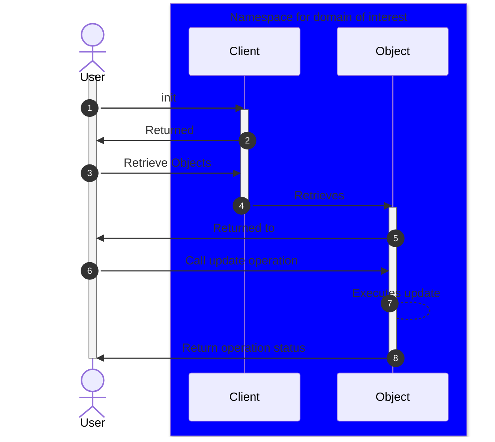
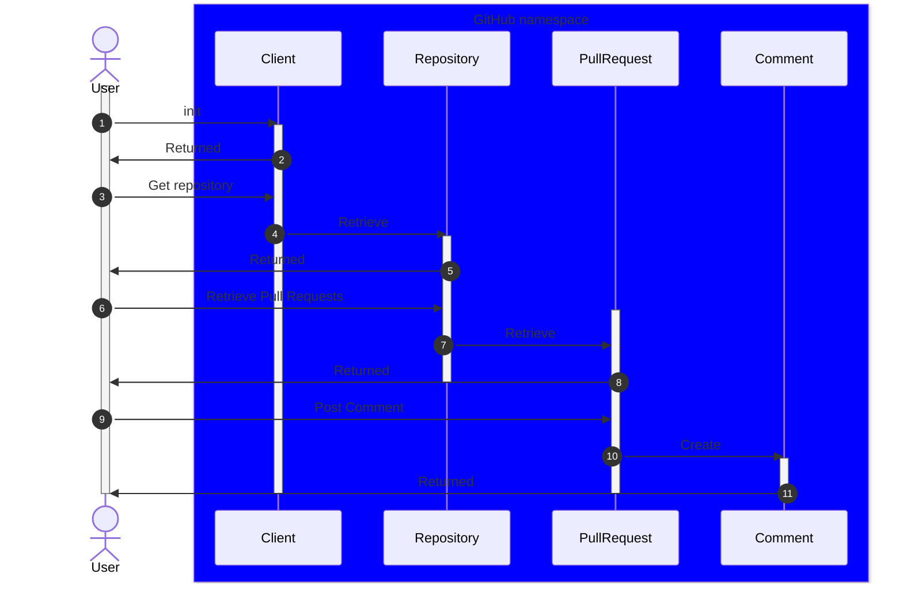

<!-- PROJECT LOGO -->
<br />
<div align="center">
  <a href="https://github.com/sudoblark/sudoblark.python.core">
    
  </a>

<h3 align="center">sudoblark.python.core</h3>

  <p align="center">
    The core Python library for Sudoblark, mainly used to power <a href="todo">magpie</a>
    <br>
    &middot;
    <a href="https://github.com/sudoblark/sudoblark.python.core/issues/new?labels=bug&template=bug-report---.md">Report Bug</a>
    &middot;
    <a href="https://github.com/sudoblark/sudoblark.python.core/issues/new?labels=enhancement&template=feature-request---.md">Request Feature</a>
  </p>
</div>

<!-- TABLE OF CONTENTS -->
<details>
  <summary>Table of Contents</summary>
  <ol>
    <li>
      <a href="#about-the-project">About The Project</a>
      <ul>
        <li><a href="#built-with">Built With</a></li>
      </ul>
    </li>
    <li>
      <a href="#getting-started">Getting Started</a>
      <ul>
        <li><a href="#prerequisites">Prerequisites</a></li>
        <li><a href="#installation">Installation</a></li>
      </ul>
    </li>
    <li><a href="#usage">Usage</a></li>
    <li><a href="#technical-documentation">Technical Documentation</a></li>
    <li><a href="#ci-cd">CI/CD</a></li>
    <li><a href="#license">License</a></li>
    <li><a href="#contact">Contact</a></li>
  </ol>
</details>

<!-- ABOUT THE PROJECT -->
## About The Project

This is the core Python library for Sudoblark, mainly used to power [magpie]() - a CLI tooling
intended to augment CI/CD operations.

The pattern it implements is roughly as follows:



This basically means:

- Operations are separated into namespaces of interest
- Each namespace has an entrypoint in the form of a `Client`
- Said `Client` is used to retrieve an object, which may
or may not have objects of its own we intend to interact with

The above may, thus, be distilled in to
```
client.get_object(<identifier>).update(<value>)
```

This does violate the Law of Demeter, and can
lead to a chain of `getter` methods. 

However, the library intends to wrap primarily around 
RESTAPIs, wherein object hierarchy is inherently nested. It also
allows for method chaining across certain class structures.

Furthermore, as we anticipate that users may want to perform actions
at _any point_ in the hierarchy keeping all of this in a single
interface will lead to quite a bit of bloat in our single class.

The primary user interface is also intended to be [magpie](TODO), wherein
we may abstract such complications away from the user.

For example, with GitHub this is how we are able to chain
objects to add a comment on a pull request:



Which, whilst a tad complicate, eases implementation as each
class just deals with its own concerns. Users may want to do other things,
such as create files on `Repository`, delete a `Comment` instance
on a `PullRequest` instance, update the contents of a `Comment` etc. Moving all of this 
to the `Client` class seems like it'll cause unnecessary bloat.


<p align="right">(<a href="#readme-top">back to top</a>)</p>

### Built With

* Library
  * [Python 3.10](https://docs.python.org/3.10/)
* Testing and quality control
  * [PyTest 7.3](https://docs.pytest.org/en/7.3.x/)
  * [flake8-pyproject](https://pypi.org/project/Flake8-pyproject/)
  * [flake8](https://flake8.pycqa.org/en/latest/)
  * [Coverage](https://pypi.org/project/coverage/)
* Packaging
  * [pyproject.toml](https://packaging.python.org/en/latest/guides/writing-pyproject-toml/)
* Documentation
  * [doxygen](https://www.doxygen.nl/manual/doxygen_usage.html)
* Pipelines
  * TODO

<p align="right">(<a href="#readme-top">back to top</a>)</p>

<!-- GETTING STARTED -->
## Getting Started

The below are instructions for how to develop the core library,
for instructions on how to install see the <a href="#usage">Usage</a>
section instead.

### Prerequisites

These installation instructions are targeted for MacOS.

* Python3.10
    ```sh
    brew install python@3.10
    ```
* Poetry
  ```sh
  python3.10 -m venv venv
  source venv/bin/activate
  pip install -U pip setuptools
  pip install poetry
  ```

### Installation

Assume a local virtual environment, and poetry, are setup as per
the <a href="#prerequisites">Prerequisites</a> then installation
is simply:

```sh
poetry install
```

Which you may verify via:

```sh
python3
import sudoblark_python_core
help(sudoblark_python_core)
```

If you need to re-generate documentation locally, simply
run the following command:

```sh
doxygen
```

<p align="right">(<a href="#readme-top">back to top</a>)</p>


<!-- USAGE EXAMPLES -->
## Usage

TODO

<p align="right">(<a href="#readme-top">back to top</a>)</p>

<!-- TECHNICAL DOCUMENTATION -->
## Technical Documentation

TODO

<p align="right">(<a href="#readme-top">back to top</a>)</p>

<!-- CI/CD -->
## CI/CD

TODO

<p align="right">(<a href="#readme-top">back to top</a>)</p>

<!-- LICENSE -->
## License

Distributed under the project_license. See `LICENSE.txt` for more information.

<p align="right">(<a href="#readme-top">back to top</a>)</p>