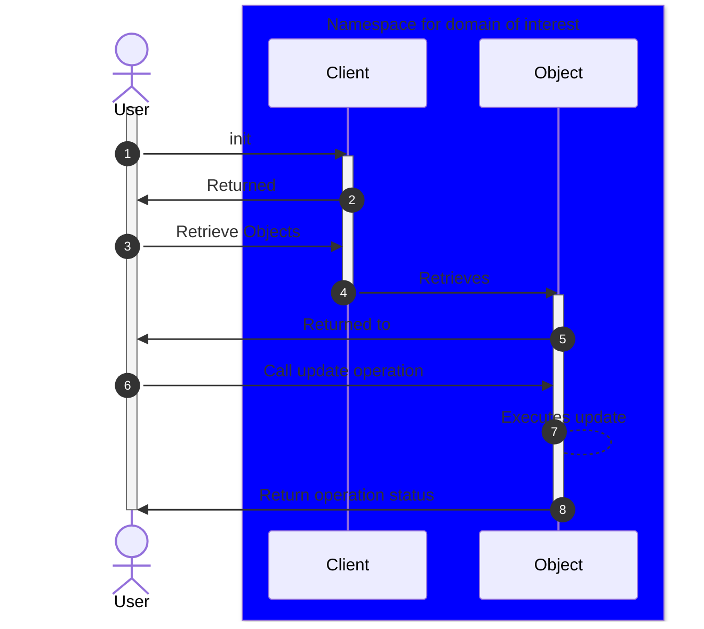

# Base model mermaid

```mermaid
sequenceDiagram
    autonumber
    actor User
    box Blue Namespace for domain of interest
    participant Client
    participant Object
    end
    activate User
    User->>Client: init
    activate Client
    Client->>User: Returned
    User->>Client: Retrieve Objects
        Client->>Object: Retrieves
    deactivate Client
    activate Object
    Object->>User: Returned to
    User->>Object: Call update operation
    Object-->Object: Executes update
    Object->>User: Return operation status
    deactivate Object
    deactivate User
```