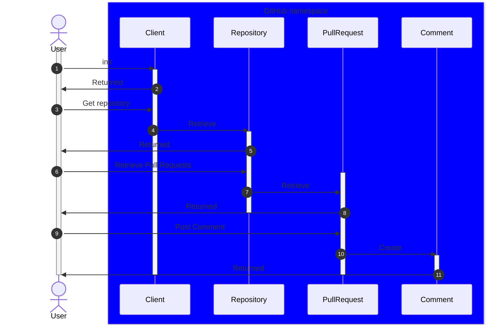

# GitHub Example mermaid

```mermaid
sequenceDiagram
    autonumber
    actor User
    box Blue GitHub namespace
    participant Client
    participant Repository
    participant PullRequest
    participant Comment
    end
    activate User
    User ->> Client: init
    activate Client
    Client ->> User: Returned
    User ->> Client: Get repository
    Client ->> Repository: Retrieve
    activate Repository
    Repository ->> User: Returned
    User ->> Repository: Retrieve Pull Requests
    activate PullRequest
    Repository ->> PullRequest: Retrieve
    PullRequest ->> User: Returned
    deactivate Repository
    User ->> PullRequest: Post Comment
    PullRequest ->> Comment: Create
    activate Comment
    Comment ->> User: Returned
    deactivate PullRequest
    deactivate Comment
    deactivate Client
    deactivate User
```