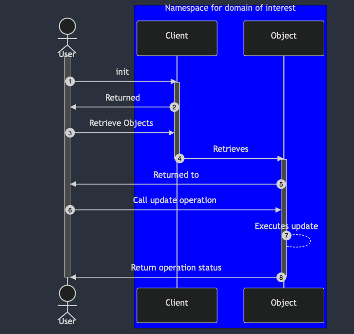
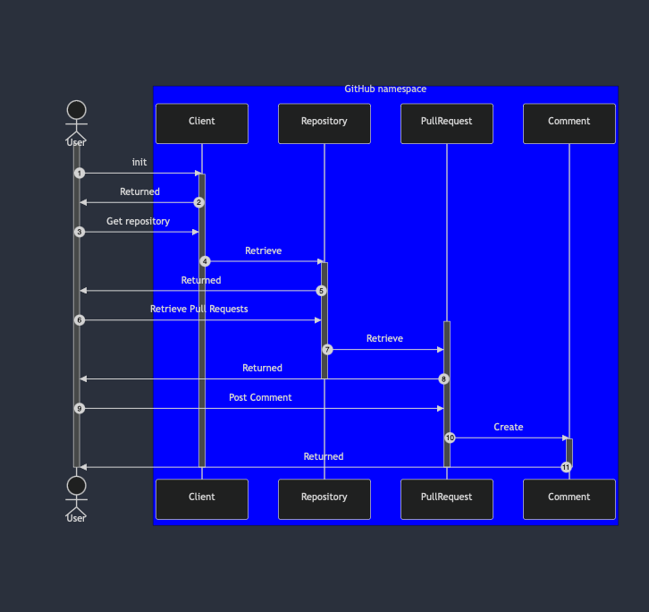

# Operating Principles

The library operates on a fundamental pattern as follows:



This basically means:

- Operations are separated into namespaces of interest
- Each namespace has an entrypoint in the form of a `Client`
- Said `Client` is used to retrieve an object, which may
or may not have objects of its own we intend to interact with

The above may, thus, be distilled in to
```python
client.get_object(<identifier>).update(<value>)
```

This does violate the Law of Demeter, and can
lead to a chain of `getter` methods. 

However, the library intends to wrap primarily around 
RESTAPIs, wherein object hierarchy is inherently nested. It also
allows for method chaining across certain class structures.

Furthermore, as we anticipate that users may want to perform actions
at _any point_ in the hierarchy keeping all of this in a single
interface will lead to quite a bit of bloat in our single class.

The primary user interface is also intended to be CLI tooling that sits
on top of the library, wherein we may abstract away such complexities.

For example, with GitHub this is how we are able to chain
objects to add a comment on a pull request for a personal repo:



Which translates to:

```python
from sudoblark_python_core import GitHubClient

client = GitHubClient()
repo = client.get_repository("benjaminlukeclark", "Get-Duplicate-Files")
pull_request = repo.get_pull_request("22")
pull_request.post_comment("./comment_file.md")
```

Or, with method chaining:
```python
from sudoblark_python_core import GitHubClient
GitHubClient().get_repository("benjaminlukeclark", "Get-Duplicate-Files") \
    .get_pull_request("22") \
    .post_comment("./comment_file.md")
```

> **_NOTE:_**  See the `Useful Examples` section for more details on 
> how to chain together classes in the library to achieve productive results.

Which, whilst a tad complicate, eases implementation as each
class just deals with its own concerns. Users may want to do other things,
such as create files on `Repository`, delete a `Comment` instance
on a `PullRequest` instance, update the contents of a `Comment` etc. Moving all of this 
to the `Client` class seems like it'll cause unnecessary bloat.